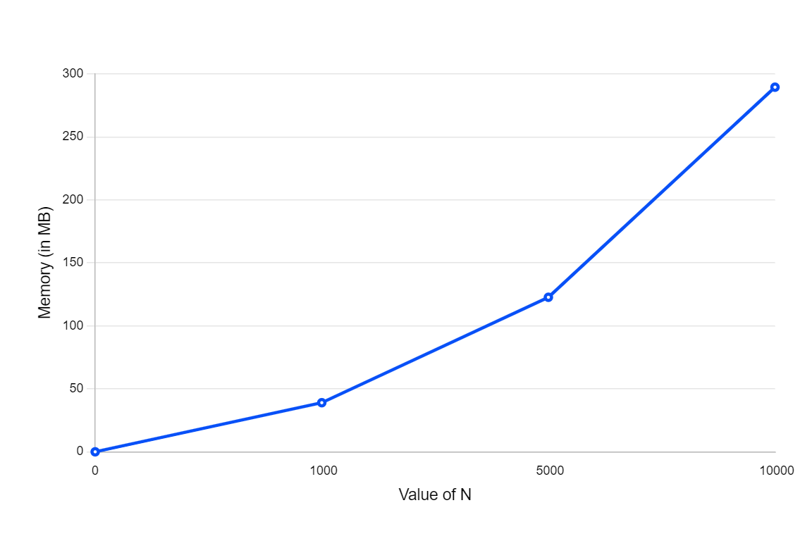

To find the output, run:
gcc -o main_test.exe main_test.c mylib/mylib.c
./main_test.exe

To find the time complexity, run:
gcc -o main_b_time.exe main_b_time.c mylib/mylib.c
./main_b_time.exe <integer>

Below is the time complexity in line graph:

To find the space complpexity, run:
gcc -o main_b_space.exe main_b_space.c mylib/mylib.c
./main_b_space.exe <integer>

Below is the space complexity in line graph:

